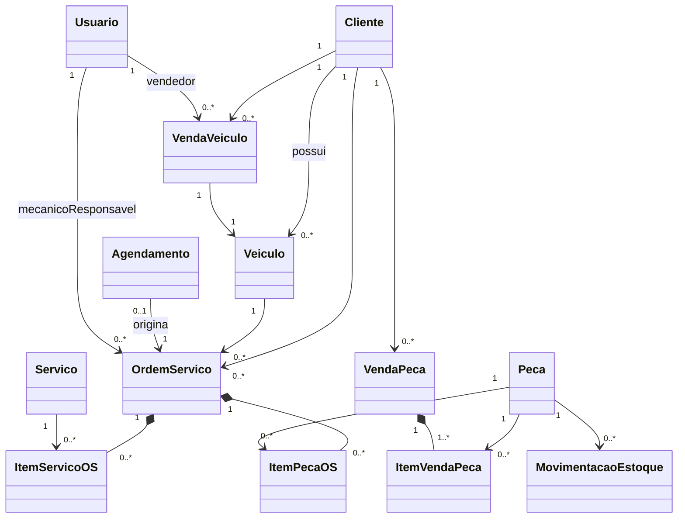

# Modelagem de Classes — Sistema de Concessionária

> Documento de modelagem do domínio. Cada atributo tem a justificativa ("por quê") registrada.
> Convenções: nomes em **português sem acentos**; toda entidade tem `id` (chave `BIGSERIAL`/`Long`)
> e as principais têm `ativo` (exclusão lógica) — nunca deletamos fisicamente registros que
> participam de histórico (OS, vendas, movimentações).

## Visão geral

---

## 1. Núcleo (cadastros)

### 1.1 Cliente

| Atributo | Tipo | Por quê |
|----------|------|---------|
| id | Long | Chave técnica. Não usamos CPF/CNPJ como chave: documento pode ser corrigido após cadastro errado, e chave natural mutável quebra os relacionamentos. |
| nome | String (obrig.) | Identificação do cliente (nome completo ou razão social). |
| tipoPessoa | Enum `FISICA` / `JURIDICA` | Concessionária vende e presta serviço para empresas (frotas). Optamos por **uma única classe com enum** em vez de herança `PessoaFisica`/`PessoaJuridica`: os comportamentos são idênticos, só muda a validação do documento — herança aqui seria complexidade sem ganho. |
| cpfCnpj | String, único | Documento fiscal. Único para impedir cadastro duplicado. Validação muda conforme `tipoPessoa`. |
| telefone | String | Contato principal — oficina precisa avisar quando a OS fica pronta. |
| email | String | Contato alternativo e envio de orçamento. |
| logradouro, numero, bairro, cidade, uf, cep | String | Endereço em campos separados (não texto livre) para permitir filtro/relatório por cidade. Como só há uma loja e um endereço por cliente, **não** criamos entidade `Endereco` separada — seria uma tabela a mais sem necessidade. |
| dataCadastro | LocalDateTime | Auditoria mínima: saber desde quando o cliente existe. |
| ativo | boolean | Exclusão lógica: cliente com OS/venda no histórico não pode ser apagado fisicamente (quebraria FK), mas pode ser desativado. |

### 1.2 Veiculo

Representa **tanto** veículos do estoque da loja (para venda) **quanto** veículos de clientes (que vêm para a oficina). Decidimos usar uma única entidade porque o veículo vendido pela loja *vira* veículo de cliente — com duas tabelas, a venda exigiria copiar dados de uma para outra e o histórico se perderia.

| Atributo | Tipo | Por quê |
|----------|------|---------|
| id | Long | Chave técnica. |
| chassi | String, único, obrig. | Identificador universal do veículo (VIN). É único no mundo, então é `unique` no banco. |
| placa | String, único, **opcional** | Veículo zero-km em estoque ainda não foi emplacado — por isso não pode ser obrigatório. Vira obrigatório na prática quando o veículo entra numa OS. |
| marca, modelo | String, obrig. | Identificação comercial. (Evolução futura: tabela `Modelo` própria; para o escopo da disciplina, texto basta.) |
| anoFabricacao, anoModelo | Integer | Padrão brasileiro exige os dois (ex.: 2025/2026); afetam precificação. |
| cor | String | Diferencia unidades do mesmo modelo no pátio. |
| quilometragem | Integer | Essencial na oficina (revisão por km) e na precificação de seminovos. Atualizada a cada entrada na oficina. |
| situacao | Enum `ESTOQUE` / `VENDIDO` / `CLIENTE` | Distingue os papéis: `ESTOQUE` = disponível para venda; `VENDIDO`/`CLIENTE` = pertence a um cliente (a diferença é se passou pela nossa venda ou só chegou pela oficina). Impede vender um veículo que não é da loja. |
| cliente | FK Cliente, opcional | Dono atual. Nulo enquanto `situacao = ESTOQUE`. Quando a venda é concluída, aponta para o comprador — assim o histórico de OS segue o veículo, não a venda. |
| precoCusto, precoVenda | BigDecimal, opcionais | Só fazem sentido para veículos da loja. **BigDecimal, nunca double/float**: ponto flutuante causa erro de arredondamento em dinheiro. |
| ativo | boolean | Exclusão lógica (mesmo motivo do Cliente). |

### 1.3 Peca

| Atributo | Tipo | Por quê |
|----------|------|---------|
| id | Long | Chave técnica. |
| codigoFabricante | String, único | Código de catálogo do fabricante — é como mecânico e balconista localizam a peça. Único para evitar duplicidade de cadastro. |
| descricao | String, obrig. | Nome legível ("Filtro de óleo 1.0/1.6"). |
| marca | String | A mesma peça existe de vários fabricantes com preços diferentes. |
| unidadeMedida | Enum `UNIDADE` / `LITRO` / `METRO` / `KIT` | Óleo vende por litro, cabo por metro. Sem isso, "quantidade 3" fica ambíguo. |
| precoCusto | BigDecimal | Base para cálculo de margem e valor de estoque. |
| precoVenda | BigDecimal | Preço praticado no balcão e na OS. Mantido na peça como preço **vigente**; o preço praticado em cada venda é **copiado** para o item (ver ItemPecaOS). |
| quantidadeEstoque | Integer | Saldo atual. **Decisão de projeto:** mantemos o saldo materializado aqui (atualizado na mesma transação da movimentação) em vez de somar as movimentações a cada consulta — consulta de disponibilidade é a operação mais frequente do sistema. A tabela de movimentações continua sendo a fonte de auditoria. |
| estoqueMinimo | Integer | Permite o relatório "peças a repor" — requisito clássico e barato de implementar. |
| ativo | boolean | Peça descontinuada não pode ser apagada (tem histórico), mas some das buscas de venda. |

### 1.4 Usuario

Sem autenticação no escopo (decisão registrada no CLAUDE.md), mas a entidade existe porque **toda operação precisa de autor**: quem abriu a OS, qual mecânico executou, qual vendedor vendeu. Sem isso não há relatório por funcionário.

| Atributo | Tipo | Por quê |
|----------|------|---------|
| id | Long | Chave técnica. |
| nome | String, obrig. | Identificação nos registros e relatórios. |
| cpf | String, único | Evita cadastro duplicado de funcionário. |
| perfil | Enum `ADMIN` / `VENDEDOR` / `MECANICO` / `ATENDENTE` / `ESTOQUISTA` | Mesmo sem login, o perfil restringe o domínio: só `MECANICO` pode ser responsável por OS, só `VENDEDOR` assina venda. Se autenticação entrar no futuro, o campo já existe. |
| ativo | boolean | Funcionário desligado sai das listas de seleção, mas mantém o histórico. |

---

## 2. Estoque

### 2.1 MovimentacaoEstoque

Registro **imutável** (só INSERT, nunca UPDATE/DELETE) de cada entrada e saída. O saldo em `Peca.quantidadeEstoque` é consequência das movimentações — nunca editado diretamente. Isso dá auditoria: qualquer divergência de estoque é rastreável.

| Atributo | Tipo | Por quê |
|----------|------|---------|
| id | Long | Chave técnica. |
| peca | FK Peca, obrig. | Qual peça se moveu. |
| tipo | Enum `ENTRADA` / `SAIDA` / `AJUSTE` | Entrada = compra/devolução; saída = consumo em OS ou venda; ajuste = correção de inventário (contagem física divergente). |
| quantidade | Integer, > 0 | Quanto se moveu. Sempre positivo — o sentido vem do `tipo`, evitando a ambiguidade de quantidade negativa. |
| origem | Enum `COMPRA` / `ORDEM_SERVICO` / `VENDA_BALCAO` / `DEVOLUCAO` / `AJUSTE_INVENTARIO` | Responde "por que o estoque mudou" — é o que transforma a tabela em trilha de auditoria. |
| referenciaId | Long, opcional | Id da OS ou da venda que causou a movimentação, permitindo navegar da divergência até o documento de origem. |
| dataHora | LocalDateTime | Quando ocorreu — base para relatório de giro e para reconstruir o saldo em qualquer data. |
| usuario | FK Usuario | Quem executou — responsabilização. |
| observacao | String, opcional | Justificativa livre, obrigatória por regra de negócio quando `tipo = AJUSTE`. |

**Regra central:** a saída valida `quantidadeEstoque >= quantidade` na mesma transação. Estoque negativo é proibido.

---

## 3. Oficina

### 3.1 Servico (catálogo)

Catálogo de serviços padronizados (troca de óleo, alinhamento, revisão 10.000 km). Sem catálogo, cada atendente digitaria descrição e preço livremente — impossibilitando padronização de preço e relatório de serviços mais executados.

| Atributo | Tipo | Por quê |
|----------|------|---------|
| id | Long | Chave técnica. |
| descricao | String, obrig. | Nome do serviço. |
| valorHoraPadrao | BigDecimal | Preço/hora sugerido — copiado para o item da OS no momento da inclusão (pode ser ajustado caso a caso). |
| tempoEstimadoHoras | BigDecimal | Base para agendar (quantos serviços cabem no dia) e para orçamento prévio. |
| ativo | boolean | Serviço descontinuado sai da lista, mantém histórico. |

### 3.2 Agendamento

| Atributo | Tipo | Por quê |
|----------|------|---------|
| id | Long | Chave técnica. |
| cliente | FK Cliente, obrig. | Quem agendou. |
| veiculo | FK Veiculo, obrig. | Qual veículo será atendido — obriga o cadastro do veículo já no agendamento, o que agiliza a recepção. |
| dataHoraAgendada | LocalDateTime | O horário reservado — o dado essencial da entidade. |
| descricaoProblema | String | Relato do cliente por telefone — orienta a triagem antes de o carro chegar. |
| status | Enum `AGENDADO` / `CONFIRMADO` / `ATENDIDO` / `CANCELADO` / `NAO_COMPARECEU` | Ciclo de vida. `NAO_COMPARECEU` existe separado de `CANCELADO` porque no-show é métrica de gestão da oficina. |
| dataCriacao | LocalDateTime | Auditoria. |

### 3.3 OrdemServico

Entidade central do sistema — é onde oficina, estoque e faturamento se encontram.

| Atributo | Tipo | Por quê |
|----------|------|---------|
| id | Long | Chave técnica. |
| numero | String, único, sequencial | Número "humano" da OS (ex.: `OS-2026-0001`), usado com o cliente. Separado do `id` para poder ter formato/sequência própria. |
| cliente | FK Cliente, obrig. | Quem paga. |
| veiculo | FK Veiculo, obrig. | O que está sendo atendido. Cliente e veículo separados porque o pagador nem sempre é o dono (frota, terceiro). |
| agendamento | FK Agendamento, opcional | Rastreia a origem quando houve agendamento; opcional porque existe atendimento por demanda (carro chega sem hora marcada). |
| status | Enum `ABERTA` / `EM_EXECUCAO` / `AGUARDANDO_PECA` / `FINALIZADA` / `FATURADA` / `CANCELADA` | Máquina de estados com transições validadas no service (ex.: só `FINALIZADA` pode ir a `FATURADA`; `FATURADA` não muda mais). `AGUARDANDO_PECA` existe porque é o gargalo real de oficina e a gerência precisa enxergá-lo. |
| quilometragemEntrada | Integer | Km no momento da entrada — histórico de revisões pertence ao veículo e é argumento de venda futura do seminovo. |
| descricaoProblema | String | Relato colhido na recepção. |
| diagnostico | String, opcional | O que o mecânico constatou — separado do relato porque frequentemente divergem. |
| mecanicoResponsavel | FK Usuario (perfil MECANICO) | Responsável técnico; base do relatório de produtividade. |
| dataAbertura | LocalDateTime | Início do ciclo. |
| dataFinalizacao | LocalDateTime, opcional | Preenchida na transição para `FINALIZADA`; junto com a abertura mede o tempo de atendimento. |
| valorTotalServicos, valorTotalPecas, valorTotal | BigDecimal | Totais **calculados** a partir dos itens e persistidos na finalização (snapshot do valor cobrado). Persistir evita recalcular em relatório e congela o valor histórico mesmo que preços mudem depois. |

### 3.4 ItemServicoOS

| Atributo | Tipo | Por quê |
|----------|------|---------|
| id | Long | Chave técnica. |
| ordemServico | FK, obrig. | Composição: item não existe sem OS. |
| servico | FK Servico, obrig. | Liga ao catálogo (relatórios de serviços mais executados). |
| horas | BigDecimal | Horas efetivamente trabalhadas — pode diferir do estimado no catálogo. |
| valorHora | BigDecimal | **Cópia** do valor no momento da inclusão (snapshot). Se apontasse só para o catálogo, um reajuste de tabela alteraria retroativamente OS antigas — erro clássico. |
| valorTotal | BigDecimal | `horas × valorHora`, persistido pelo mesmo motivo do snapshot. |
| mecanico | FK Usuario | Quem executou **este** item — numa OS grande, trabalham vários mecânicos; o responsável da OS não basta para medir produtividade individual. |

### 3.5 ItemPecaOS

| Atributo | Tipo | Por quê |
|----------|------|---------|
| id | Long | Chave técnica. |
| ordemServico | FK, obrig. | Composição. |
| peca | FK Peca, obrig. | Qual peça foi aplicada. |
| quantidade | Integer, > 0 | Quantas unidades. |
| precoUnitario | BigDecimal | Snapshot do `precoVenda` da peça no momento da inclusão (mesmo raciocínio do `valorHora`). |
| valorTotal | BigDecimal | `quantidade × precoUnitario`. |

**Regra central:** incluir um `ItemPecaOS` gera uma `MovimentacaoEstoque` de saída (origem `ORDEM_SERVICO`) **na mesma transação**; remover o item (OS ainda aberta) gera movimentação de devolução. Item e estoque nunca ficam inconsistentes.

---

## 4. Vendas

### 4.1 VendaVeiculo

| Atributo | Tipo | Por quê |
|----------|------|---------|
| id | Long | Chave técnica. |
| numero | String, único | Número humano do documento de venda. |
| veiculo | FK Veiculo, obrig. | Só pode vender veículo com `situacao = ESTOQUE` — regra validada no service. Concluída a venda: `situacao = VENDIDO` e `veiculo.cliente` = comprador. |
| cliente | FK Cliente, obrig. | Comprador. |
| vendedor | FK Usuario (perfil VENDEDOR) | Comissão e relatório de desempenho. |
| dataVenda | LocalDateTime | Quando ocorreu. |
| valorVenda | BigDecimal | Valor negociado — pode diferir do `precoVenda` anunciado (desconto), por isso é registrado na venda e não lido do veículo. |
| formaPagamento | Enum `DINHEIRO` / `PIX` / `CARTAO` / `FINANCIAMENTO` / `CONSORCIO` | Relatório gerencial. Detalhes de financiamento (banco, parcelas) ficam **fora do MVP**. |
| status | Enum `CONCLUIDA` / `CANCELADA` | Cancelamento devolve o veículo ao estoque; nunca deletamos a venda (auditoria). |

### 4.2 VendaPeca (balcão) e ItemVendaPeca

Venda de peças no balcão, sem OS. Cabeçalho + itens (mesmo padrão da OS) porque uma venda tem N peças.

**VendaPeca**

| Atributo | Tipo | Por quê |
|----------|------|---------|
| id | Long | Chave técnica. |
| numero | String, único | Documento humano. |
| cliente | FK Cliente, obrig. | Decisão: **balcão exige cadastro** (nome + documento bastam). Simplifica o modelo (sem "consumidor anônimo") e alimenta o histórico do cliente. |
| vendedor | FK Usuario | Autoria. |
| dataVenda | LocalDateTime | Quando. |
| valorTotal | BigDecimal | Soma dos itens, persistida (snapshot). |
| formaPagamento | Enum (mesma da VendaVeiculo) | Relatório. |
| status | Enum `CONCLUIDA` / `CANCELADA` | Cancelar devolve itens ao estoque via movimentações de entrada. |

**ItemVendaPeca**

| Atributo | Tipo | Por quê |
|----------|------|---------|
| id | Long | Chave técnica. |
| venda | FK VendaPeca, obrig. | Composição. |
| peca | FK Peca, obrig. | O que foi vendido. |
| quantidade | Integer, > 0 | Quanto. Gera `MovimentacaoEstoque` de saída (origem `VENDA_BALCAO`) na mesma transação. |
| precoUnitario | BigDecimal | Snapshot do preço vigente. |
| valorTotal | BigDecimal | `quantidade × precoUnitario`. |

---

## 5. Decisões de modelagem (resumo executivo)

1. **Snapshot de preços em todos os itens** — histórico financeiro nunca muda retroativamente.
2. **BigDecimal para qualquer dinheiro** — nunca double/float.
3. **Saldo materializado + movimentações imutáveis** — performance na consulta, auditoria no histórico.
4. **Exclusão lógica (`ativo`)** em tudo que participa de histórico.
5. **Uma entidade Veiculo** para estoque e clientes — o veículo transita entre os papéis via `situacao`.
6. **Enum + validação no service** para máquinas de estado (OS, agendamento, vendas) — transições inválidas são erro de negócio.
7. **Usuario sem autenticação** — existe para autoria e relatórios; login fica fora do escopo da disciplina.
