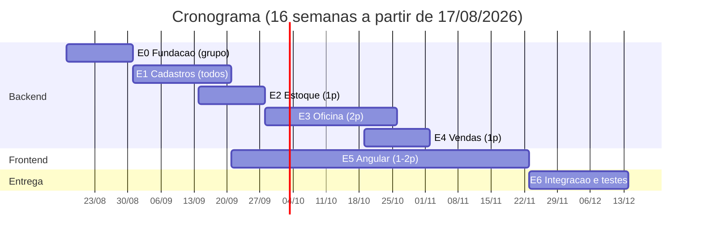

# Plano de Desenvolvimento — Sistema de Concessionária

> Projeto de disciplina (Unipar). Desenvolvimento **humano**, equipe de **3+ pessoas**,
> prazo de **um semestre (~16 semanas)**. Backend Java 8 / Spring Boot 2.7.18 (restrição
> do ambiente estudantil), frontend Angular, banco PostgreSQL.
> A modelagem detalhada está em [MODELAGEM_CLASSES.md](MODELAGEM_CLASSES.md).

## 1. Premissas e restrições

- **Java 8 / Spring Boot 2.7.18**: restrição do ambiente da instituição. Consequências
  práticas: usar `javax.*` (não `jakarta.*`), `javax.validation` para Bean Validation,
  e conferir compatibilidade de qualquer dependência nova com Boot 2.7.
- **Sem autenticação/login**: a entidade `Usuario` existe apenas para autoria das operações.
- **Loja única**: nada de multi-tenant; estoque é global.
- **Fora do escopo (MVP)**: NF-e, financeiro (contas a pagar/receber), comissões,
  financiamento detalhado, multi-loja, login.

## 2. Arquitetura e padrões (definir na Etapa 0, valem para todos)

- **Camadas**: `controller` (REST, só orquestra) → `service` (regras de negócio,
  transações) → `repository` (Spring Data JPA). Entidade JPA nunca sai do backend:
  controllers recebem/retornam **DTOs**.
- **Pacotes por módulo** (não por camada no topo):
  `com.api.spring.{nucleo|estoque|oficina|vendas}.{controller,service,repository,model,dto}` —
  facilita dividir o trabalho entre os membros sem conflito de merge.
- **Migrações Flyway**: toda mudança de schema é um arquivo `V<n>__descricao.sql`.
  `ddl-auto=validate` (nunca `update`). Numeração de migração combinada no grupo antes
  de criar (evita colisão de versão entre branches).
- **Tratamento de erros**: um `@ControllerAdvice` global; regras de negócio violadas
  lançam exceção própria (`RegraNegocioException`) → HTTP 422 com mensagem clara.
- **Transações**: operações que tocam estoque (item de OS, venda, cancelamento) são
  `@Transactional` — item + movimentação + saldo na mesma transação, sempre.
- **Git**: branch `main` protegida; uma branch por tarefa; Pull Request revisado por
  **outro** membro antes do merge. Commits pequenos, mensagens em português.
- **Definição de pronto (DoD)**: migração criada + endpoint funcionando + validações +
  regra de negócio testada (teste de service) + PR revisado.

## 3. Etapas e cronograma (16 semanas)

### Etapa 0 — Fundação técnica (semanas 1–2) · todo o grupo junto
Objetivo: qualquer membro consegue rodar o projeto e criar um CRUD no padrão.
- Docker Compose com PostgreSQL (ou instância local padronizada).
- Datasource configurado; Flyway integrado com migração `V1` vazia de baseline.
- Estrutura de pacotes, `@ControllerAdvice`, exceção de negócio, padrão de DTO.
- Um CRUD de exemplo completo (sugestão: `Servico`, o mais simples) feito **em conjunto**
  — vira o gabarito que todos copiam.
- **Marco M0**: projeto sobe, migração roda, CRUD de exemplo funciona via Postman/Insomnia.

### Etapa 1 — Núcleo de cadastros (semanas 3–5) · dividir por entidade
- `Cliente`, `Veiculo`, `Peca`, `Usuario`: CRUD completo com validações
  (CPF/CNPJ, chassi único, preços não negativos, etc.).
- Cada membro assume 1–2 entidades — são independentes entre si nesta fase.
- **Marco M1**: os quatro cadastros funcionando com validação e busca básica
  (por nome, documento, placa, código de fabricante).

### Etapa 2 — Estoque (semanas 5–7) · 1 pessoa, com revisão do grupo
- `MovimentacaoEstoque` + serviço de estoque (entrada, saída com validação de saldo,
  ajuste com observação obrigatória).
- Endpoint de consulta de saldo e extrato de movimentações por peça.
- Relatório "peças abaixo do estoque mínimo".
- **Marco M2**: impossível gerar saldo negativo; toda mudança de saldo tem movimentação.
- ⚠️ É o módulo mais crítico: oficina e vendas dependem dele. A regra de transação
  (saldo + movimentação juntos) deve ser revisada por todo o grupo.

### Etapa 3 — Oficina (semanas 7–11) · 2 pessoas
- `Servico` (se não foi o CRUD-gabarito), `Agendamento` com ciclo de status.
- `OrdemServico` com máquina de estados; inclusão/remoção de `ItemServicoOS` e
  `ItemPecaOS` (integrando com o serviço de estoque da Etapa 2).
- Finalização (calcula e persiste totais) e faturamento simples (status `FATURADA`).
- **Marco M3**: fluxo completo — agendar → abrir OS → apontar serviço → aplicar peça
  (baixa automática de estoque) → finalizar → faturar.

### Etapa 4 — Vendas (semanas 10–12) · 1 pessoa
- `VendaVeiculo`: valida `situacao = ESTOQUE`, transfere veículo ao cliente.
- `VendaPeca` + itens com baixa de estoque; cancelamento com estorno.
- **Marco M4**: vender veículo e peças de balcão, com estoque e situação consistentes.

### Etapa 5 — Frontend Angular (semanas 6–14, em paralelo) · 1–2 pessoas
Começa **após M1** (APIs de cadastro prontas para consumir). Projeto Angular em
repositório/pasta separada.
- Semanas 6–8: setup, layout base (menu, listagem/formulário padrão), telas de cadastros.
- Semanas 9–11: telas de estoque (saldo, movimentações, reposição).
- Semanas 11–14: telas de oficina (agenda, OS — a tela mais complexa) e vendas.
- **Marco M5**: fluxo da oficina executável de ponta a ponta pela interface.

### Etapa 6 — Integração, testes e entrega (semanas 14–16) · todo o grupo
- Testes de integração dos fluxos completos; carga de dados de demonstração (seed).
- Correções, README com instruções de execução, roteiro da apresentação.
- **Marco M6**: demo de ponta a ponta sem intervenção manual no banco.

### Linha do tempo

## 4. Divisão sugerida para equipe de 3 (ajustar se forem mais)

| Membro | Responsabilidade principal |
|--------|---------------------------|
| A | Núcleo (2 cadastros) → Estoque → apoio na integração |
| B | Núcleo (2 cadastros) → Oficina (OS e itens) |
| C | Núcleo (participa da Etapa 0/1) → Frontend Angular desde M1 |

Com 4+ membros: segunda pessoa na oficina (agendamento separado da OS) ou no frontend.
**Rodízio de revisão**: quem não escreveu o código revisa o PR — todos conhecem o sistema
inteiro na apresentação.

## 5. Riscos e mitigação

| Risco | Impacto | Mitigação |
|-------|---------|-----------|
| Estoque inconsistente (item sem movimentação) | Alto — invalida oficina e vendas | Regra de transação única definida na Etapa 2 e revisada em grupo; testes de service obrigatórios nesse módulo |
| Tela de OS complexa demais no Angular | Atraso na entrega | Começar o frontend pelos cadastros (simples); tela de OS pode ser dividida em abas (dados / serviços / peças) |
| Colisão de migrações Flyway entre branches | Build quebrado | Reservar número da migração no grupo (planilha/canal) antes de criar |
| Dependência nova incompatível com Boot 2.7/Java 8 | Retrabalho | Checar matriz de compatibilidade antes de adicionar qualquer dependência |
| Membro sobrecarregado/bloqueado | Atraso em cascata | Marcos quinzenais (M0–M6) como checkpoint de replanejamento |

## 6. Critérios de sucesso da entrega

1. Fluxo da oficina completo via interface: agendar → OS → serviços + peças → finalizar → faturar.
2. Venda de veículo e de peças com estoque consistente (extrato de movimentações fecha com o saldo).
3. Nenhum acesso direto ao banco necessário durante a demo.
4. Qualquer membro do grupo consegue explicar qualquer módulo (garantido pelo rodízio de revisão).
